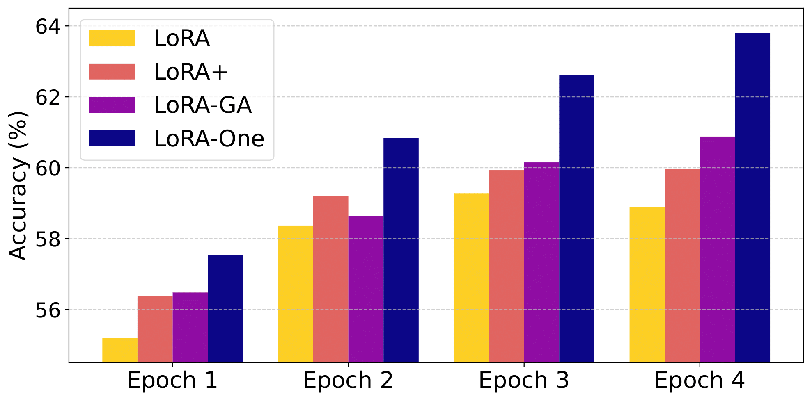

The Official PyTorch implementation of [**LoRA-One: One-Step Full Gradient Could Suffice for Fine-Tuning Large Language Models, Provably and Efficiently**](https://arxiv.org/abs/2502.01235).

### Content Overview

This paper explores how theory can guide and enhance practical algorithms, using Low-Rank Adaptation (LoRA) ([Hu et al., 2022](https://arxiv.org/abs/2106.09685)) in large language models as a case study. We rigorously prove that, under gradient descent, LoRA adapters align with specific singular subspaces of the one-step full fine-tuning gradient. This result suggests that, by properly initializing the adapters using the one-step full gradient, subspace alignment can be achieved immediately—applicable to both linear and nonlinear models. Building on our theory, we propose a theory-driven algorithm, LoRA-One, where the linear convergence (as well as generalization) is built and incorporating preconditioners theoretically helps mitigate the effects of ill-conditioning. Besides, our theory reveals connections between LoRA-One and other gradient-alignment-based methods, helping to clarify misconceptions in the design of such algorithms. LoRA-One achieves significant empirical improvements over LoRA and its variants across benchmarks in natural language understanding, mathematical reasoning, and code generation.
<h1 align="center"> 
    
</h1>

---
### Algorithmic Overview

For each weight matrix, we first compute the full-batch gradient $\nabla_{W} L$ under full fine-tuning and perform SVD on $-\nabla_{W} L$ to get $U$, $\Sigma$, $V$, then we initialize LoRA via
```math
\mathbf{A}_{0}=\frac{1}{\sqrt{\gamma}} U_{[:,:r]} Diag(S[:r])\,,\quad \mathbf{B}_{0}=\frac{1}{\sqrt{\gamma}} Diag(S[:r]) V_{[:,:r]}^\top\,,\quad W_{adapted} = W_{pre}+\frac{\alpha}{\sqrt{r}}\mathbf{A}_{0} \mathbf{B}_{0}\,,
```
which is equivalent to perform one best r-rank full-batch gradient descent under full fine-tuning with learning rate $\frac{\alpha}{\gamma\sqrt{r}}$ at the initialization. The pre-conditioners (if needed) are modified from [Scaled-Adam](https://github.com/pilancilab/Riemannian_Preconditioned_LoRA.git).

---
### Quick Start

Specific config parameters:
```
model:
  bf16: true # set true if needed
  max_length: 1024 # input max length for training
  prec_reg: 1.0e-06 # adjust for pre-conditioners
  saving: false # if true, the model will merge adapters then save after training
init:
  mode: gradient
  direction: LoRA-One
  max_length: 1024 # input max lenght using for computing full-batch gradient, recomment to be consistent with max_length in model
  scale: stable
  stable_gamma: 128 # gamma parameter in the init
  # the gradient batch size is bsz x iters
  bsz: 1 # sub-batch size per iteration for full gradient compute
  iters: 8 # total number of iterations for full gradient compute
```

To use LoRA-One **without** pre-conditioners, please use the following slurm command
```
srun python run_exp.py -m ++dataset_name=meta_math model.epochs=1 model.eval_epochs=1 ++model.saving=true +init=gradient ++peft.lora_r=8 +peft=all wandb.name="enter-name-here" ++init.weight="stable" peft.use_rslora=True peft.lora_alpha=16 ++init.stable_gamma=128 model.learning_rate=2e-4 ++seed=9 ++init.direction="LoRA-One"
```

For multi-GPU training, please use the following slurm command (2 GPUs example)
```
CUDA_VISIBLE_DEVICES="0,1" python -m accelerate.commands.launch \
--main_process_port $(shuf -i 10000-60000 -n 1) \
--config_file accelerate_config.yaml \
run_exp.py -m model.epochs=3 model.eval_epochs=3 ++model.saving=false model.real_batch_size=16 ++dataset_name=commonsense_reasoning +init=gradient ++init.direction="LoRA-One" ++init.max_length=256 ++model.max_length=256 ++peft.lora_r=16 +peft=qv wandb.name="enter-name-here" ++init.scale="stable" peft.use_rslora=True peft.lora_alpha=16 ++peft.lora_dropout=0.05 ++init.stable_gamma=128 model.learning_rate=5e-5 ++seed=42
```

The code for LoRA-One **with** pre-conditioners is under revision. We will release once done.

---
### Evaluation

#### Math
To evaluate fine-tuned model on GSM8K by Greedy decoding (recommended for math task), please use the following slurm command:
```
srun python eval_gsm8k.py --model_name="merged_model_path" --wandb_name="enter-name-here"
```
If you want to use top_p sampling instead, please use the following slurm command:
```
srun python eval_gsm8k.py --model_name="merged_model_path" --wandb_name="enter-name-here" --temperature=xxx ---top_p=xxx
```

Furthermore, to evaluate Few-shot CoT accuracy, we recommend to use [lm-evaluation-harness](https://github.com/EleutherAI/lm-evaluation-harness.git) (Install instruction can be found in their github page). Please use the following slurm command (for 8-shot cot):
```
lm_eval --model hf \
    --model_args pretrained=merged_model_path \
    --tasks gsm8k_cot \
    --batch_size auto
```

#### Code
First, generate $n$ sample using the following slurm command:
```
srun python eval_humaneval.py --model_name="merged_model_path" --num_sample=1
```
Next, git-clone [human-eval](https://github.com/openai/human-eval.git) and get Pass@k Score using the following slurm command:
```
srun python evaluate_functional_correctness.py --sample_file="generated_samples_path" --k=1
```

#### Commonsense Reasoning
Notice that, due to the max_length was restricted to 256 according to the prior works e.t.c. [LLM-Adapters](https://github.com/AGI-Edgerunners/LLM-Adapters.git), [DoRA](https://github.com/NVlabs/DoRA.git), the trained model likelihood becomes sharp which brought instability to generation under their gen configs. We utilize the generation by integrating previous top_p sampling and beam-search decoding, which solves this issue and raise the accuracy.

To evaluate on datasets {"boolq" "piqa" "social_i_qa" "hellaswag" "winogrande" "ARC-Challenge" "ARC-Easy" "openbookqa"}, please use the following slurm command:
```
srun python commonsense_evaluate.py \
    --dataset {dataset_name} \
    --base_model merged_model_path \
    --name enter-name-here \
    --batch_size 1
```

#### Instruction-Tuning
To evaluate on MMLU, please use the following slurm command:
```
srun python eval_mmlu.py "merged_model_path"
```
We remark that LoRA-One can work very well using only a small sampled batch (8~64) to compute the one-step full gradient for initialization.

---
## Acknowledgement
We greatly appreciate two remarkable repositories: [LoRA-GA](https://github.com/Outsider565/LoRA-GA.git), [Prec-LoRA](https://github.com/pilancilab/Riemannian_Preconditioned_LoRA.git).

---

## Citation

If this work is relevant to your research, please cite:

```bibtex
@article{zhang2025one,
  title={One-step full gradient suffices for low-rank fine-tuning, provably and efficiently},
  author={Zhang, Yuanhe and Liu, Fanghui and Chen, Yudong},
  journal={arXiv preprint arXiv:2502.01235},
  year={2025}
}
```
